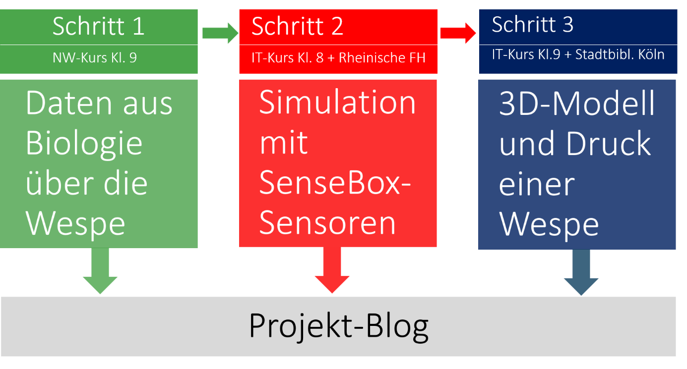
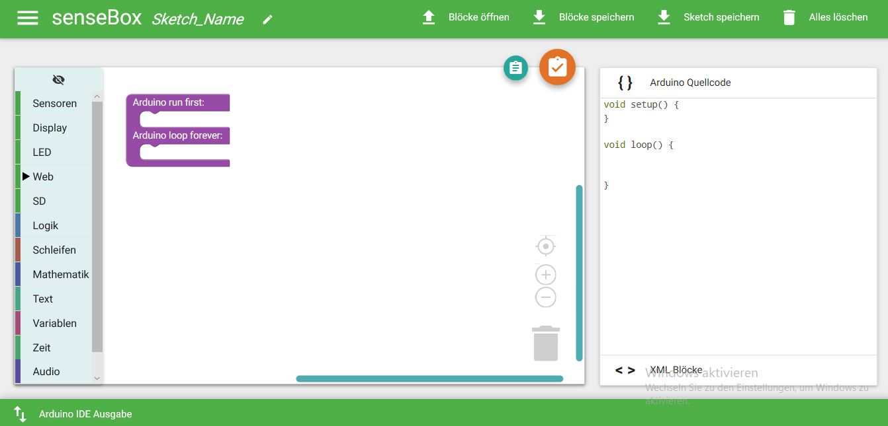

# AnimalSim

## Übersicht

Im Zentrum der in Kollaboration der Autorinnen entwickelten und durchgeführten Unterrichtsidee "Tiersimulation mit Mikrocontroller und 3D-Druck" steht das Exponat einer Wespensimulation und eine dazugehörige selbst produzierte Projektwebseite. Ziel des Projekts war die Entwicklung eines Prototypen für eine Art Verhaltenstrainer im öffentlichen Raum, durch den Menschen das Verhalten einer Wespe besser verstehen können. In direkter Interaktion mit dem Verhaltenssimulator wird deutlich, wann eine Wespe Stress hat und eventuell zusticht. Die Wahl des Insekt fiel deshalb auf die Wespe, weil einerseits die Motivation zur eigenen Verhaltensänderung als Präventivmaßnahme vor schmerzhaften Stichen sehr hoch ist und andererseits ein Insekt ist, mit der Menschen tatsächlich häufig in Kontakt sind und die zur Lebenswelt der Schülerinnen gehört.

Das die Fächer Informatik, Biologie und Technik verbindende Projekt entstand in drei Lerngruppen des Differenzierungsbereichs, wobei die einzelnen Arbeitsbereiche aufgeteilt wurden: Auf Basis der biologischen Daten des NW-Diff-Kurses der Jahrgangsstufe 9 von Andrea Heiseler entwickelte der 8er Informatik-Diff-Kurs der Klasse 8 von Jacqueline Anthes die sensorzentrierte Programmierung mit einer Sensebox - einer Art mikrocontrollerbasierter Station zur Erhebung von Umweltdaten. Abgerundet wurde das Projekt durch ein unter der Leitung von Florian Haase 3D-gedrucktes Modell einer Wespe, das von den Schüler\*innen des INF-Diff-Kurses der Jahrgangsstufe 9 entwickelt wurde.

Für den 3D-Druck kooperierten wir mit dem Makers Space der Stadtbibliothek Köln, das Schülerinnen-Labor der Rheinische FH unterstütze uns im Bereich Sensorik und das zdi-Zentrum Köln half bei der Vernetzung. Auf diese Weise erhielen Schüerinnen und Lehrkräfte nicht nur Tipps und Tricks durch fachkundige Studierende und Professoren, sondern auch \(IT-\)Infrastruktur der Rheinischen Fachhochschule. Die gesamte Dokumentation wurde dabei von den Schüler\*innen in Form eines Blogs veröffentlicht. Dieser ist unter folgendem Link zu finden: [https://jacanthes.wixsite.com/tiersimulationen](https://jacanthes.wixsite.com/tiersimulationen). Ein sechsminütiges, selbst produziertes Erklärvideo verschafft Interessierten einen schnellen Überblick über die Ergebnisse und einen Einblick in die Projektarbeit.

## Reihenplanung

Koordination eines fächerverbindenden, jahrgangsstufenübergreifenden Projektes

An dem Projekt sind insgesamt drei sogenannte "Differenzierungs-Kurse" der Jahrgangsstufen 8 und 9 beteiligt. Der Schaffensprozess vollzog sich in drei wesentlichen aufeinander aufbauenden Stufen wie folgende Grafik illustriert: 

#### verbindende Unterrichtsziele

* Förderung der Umweltbildung
* Sensibilisierung für die Auswirkung von veränderten Umweltbedingung auf Lebewesen unserer Lebenswelt
* Erweiterung fächerübergreifender Denk- und Sichtweisen
* Jahrgangsstufenübergreifende Kollaborationen
* Umgang mit digitalen Medien und Werkzeugen

#### Austausch und Kollaboration durch den Einsatz digitaler Medien

Die eigens für dieses Projekt programmierte Webseite mit eingebetteten Blog bildete eine schülerorientierte, leicht zu bedienende Plattform zum gemeinsamen kollaborativen Arbeiten über Fächer und Jahrgangsstufen hinweg.

Webseite und Blog wurden mit Hilfe des cloudbasierten CMS wix.com erstellt und administriert. Alle Schüler\*innen hatten ihren eigenen Zugang und Rechte als Blog-Autor\*in. Die Webseite, in die der Blog-Teil eingebettet ist, wurde von uns Lehrkräften in Hinblick auf Inhalte und Struktur entwickelt.

#### Förderung von Medienkompetenzen im Sinne des Medienkompetenzrahmens NRW

Alle Unterrichtsreihen eignet sich insbesondere durch die Blog-Funktion der Projekt-Webseite neben der Vermittlung relevanter informatorischer und biologischer Inhalte gezielt für die Medienkompetenzförderung im Sinne des [Medienkompetenzrahmens NRW](https://medienkompetenzrahmen.nrw/medienkompetenzrahmen-nrw/): Alle sechs [Kompetenzbereiche](https://medienkompetenzrahmen.nrw/fileadmin/pdf/LVR_ZMB_MKR_Rahmen_A4_2019_06_Final.pdf) werden in hohem Maße Bereichen gestärkt.

In der den Übersichtsrastern der jeweiligen Makro-Planung sind die geförderten Medienkompetenzen aufgeführt.

### NW-Kurs

### Diff-IT \(8\)

**Die Simulation der Sensorik einer Wespe wurde von dem Differenzierungskurs Informatik der Jahrgangsstufe 8 modelliert und mit Hilfe der SenseBox - einer Arduino-kompatiblen MCU - sowie zugehöriger, speziell für die Messung von Umweltdaten entwickelten Sensoren implementiert.**

**Die insgesamt 20 Schüler\*innen verfügten über Programmierkenntnisse auf Einsteiger\*innen-Niveau.** **Ihre Arbeitsschritte und Ergebnisse haben sie schriftlich in Form von Blog-Artikeln zusammengefasst, durch Screenshots und Bilder illustriert und kritisch reflektiert. Darüber hinaus können die \(Teil-\) Ergebnisse der Schüler\*innen für die Wiederverwendung aus dem Blog herunter geladen werden.**

#### Ziele der Unterrichtsreihe

Die Ziele der Unterrichtsreihe decken sich mit denen auf den [Seiten der SenseBox](https://sensebox.de/docs/lehrkraefte_senseBox_de.pdf) definierten grundlegenden Ziele des Microcontrollers und werden hier zitiert und ergänzt:

* Erlernen der Grundlagen der Programmierung \(über den Informatikunterricht hinaus\)
* Eigenständige Erfassung und Auswertung von Umweltdaten

#### Didaktische Konzeption

Die 20 Schüler\*innen hatten zum Zeitpunkt der Durchführung erstmalig in ihrer Schulkariere seit fünf Monaten Informatik-Unterricht. Ihre Programmierkenntnisse sind deswegen als basal einzustufen. Mit Hilfe der Programmierumgebung Sonic Pi \("\Audible Programming"\) hatten sie bereits den Einsatz von Kontrollstrukturen erlernt und eingesetzt. Die Verwendung von Variablen sowie die Ausgabe von Strings haben sie im Rahmen des Projekts neu erlernt. Aus diesem Grunde war für die Wahl des Systems relevant, dass sich die MCU über eine block-basierte Programmierung ansteuern ließ, um den Schüler\*innen die Programmierung zu erleichtern. Die Arduino-Blockly hat sich für unsere Zwecke äußerst bewährt: Die Oberfläche lässt sich leicht bedienen, ist sehr gut dokumentiert und die Ansteuerung der Sensoren funktioniert fehlerfrei. Die Schüler\*innen kamen sehr schnell zu Ergebnissen und haben nach eigenen Angaben Spaß an der Programmierung gehabt.

Wie jede Lerngruppe ist diese sehr heterogen und die Interessensschwerpunkte verschieden. Deswegen wurde eine umfangreiche Materialsammlung \(Lernkarten, Erklärvideos, Musterlösungen\) online bereit gestellt. Dies hat die Schüler\*innen darüber hinaus in der selbstgesteuerten und eigenverantwortlichen Gruppenarbeiten unterstützt.

Vielen Schüler\*innen ist die schriftliche Dokumentation und adressatengerechte Präsentation der eigenen Arbeitsschritte schwer gefallen. Das Verfassen von Blog-Artikeln hat allerdings eine hohe Motivation dargestellt. Methoden der Deutsch-Didaktik \("Schreib-Werkstatt"\) empfehlen sich hier.

Alle von den Schüler\*innen dieses Kurses verfassten Artikel wurden im Blog mit dem Label "Simulation der Sensorik" versehen.

#### Digitale Werkzeuge

**SenseBox**

Für die Realisierung der Simulation einer Wespe mittels eines Microcontrollers haben wir uns für die SenseBox entschieden.

Die senseBox:edu ist ein Elektronikbausatz für Schulen, Universitäten und Bildungseinrichtungen, bei dem das Experimentieren und Programmieren unter Einsatz von Sensoren im Vordergrund steht. Neben einer programmierbaren Open-Source Mikrocontrollereinheit \(MCU\), die Arduino kompatibel ist, sind Sensoren, Bauteile zur Übertragung von Daten ins Internet und weiteres Zubehör im Lieferumfang enthalten. Mit der senseBox:edu können Grundlagen der Informatik an realen Problemstellungen aus dem gesamten MINT-Bereich erlernt sowie eigene Messgeräte für verschiedene Zwecke mit wenig Aufwand gebaut und programmiert werden. Sensoren für die Messung von verschiedenen Umweltphänomenen wie Temperatur, Luftfeuchtigkeit, Luftdruck, Beleuchtungsstärke, UV-Strahlung, Lautstärke, Distanzen \(per Ultraschallsensor\) sowie Neigung und Ausrichtung ermöglichen ein kreatives Arbeiten an einer Vielzahl von Fragestellungen.

Insgesamt wurden folgende Hardware-Komponenten angeschafft und verwendet:

* Fünf SenseBox-MCUs für das Programmieren in Teams \(4 Schüler\*innen pro Gruppe\)
* Fünf OLED-Displays
* Luftdruck-Sensor
* Bodenfeuchtigkeitssensor
* Temperatur- und Luftfeuchtigkeitssensor
* Feinstaubsensor
* UV-/ Helligkeitssensor
* RGB-LEDs
* Breadboards
* Jumper Kabel

#### Struktur der Unterrichtsreihe

In der folgenden Übersicht finden Sie die Makroplanung der Reihe mit allen verwendeten Arbeitsmaterialien und Produkten der Schüler\*innen. Der besseren Lesbarkeit halber können Sie sich das [Reihen-Übersichtsraster](https://github.com/cc-education/AnimalSim/blob/master/Reihenplanung%20Diff-8%20IF.pdf) als PDF herunterladen.

Als Kooperationspartner für diese Reihe stand das Schüler\*innen-Labor der Rheinischen FH unter der Leitung von Prof. Doost zur Verfügung, dem wir für die hilfreiche Unterstützung zusammen mit seinem Team danken.

| **Einheit** | **Dauer und Arbeitsform** | **Thema** | **Material/ Aufgabenstellung** | **Produkt** | **Kompetenzen:** [**\(M\)edienkomptetenzen**](https://medienkompetenzrahmen.nrw/fileadmin/pdf/LVR_ZMB_MKR_Rahmen_A4_2019_06_Final.pdf)**,** [**\(I\)nformatik-Lehrplan**](https://www.schulentwicklung.nrw.de/lehrplaene/lehrplannavigator-s-ii/gymnasiale-oberstufe/informatik/informatik-klp/kompetenzen/kompetenzen.html) |
| :--- | :--- | :--- | :--- | :--- | :--- |
| 1 | 1 Doppelstunde, Plenum und Gruppenarbeit | Die Sensorik der Wespe | [Blog-Artikel des NW-Kurses der Jahrgangsstufe 9](https://jacanthes.wixsite.com/tiersimulationen/blog/categories/biologie) zu den relevanten biologischen Daten einer Wespe und Zuordnung zu den SenseBox-Sensoren | [Blog-Artikel "Sensorenplan"](https://jacanthes.wixsite.com/tiersimulationen/post/die-sensoren-der-wespe-und-wie-sie-sich-programmieren-lassen) | **M**: 1.1, 1.2, 1.3, 2.1, 2.2, 3.1, 4.1, 4.3, 6.1 **I**: Argumentieren, Kommunizieren und Kooperieren, Informatik-Systeme, Informatik, Mensch und Gesellschaft |
| 2 | 1 Doppelstunde, Gruppenarbeit | Modellierung einer "Stress-Ampel" für die jeweiligen Sensoren, Informationen über Sensoren der SenseBox recherchieren und auswerten | [Arbeitsblatt Stress-Ampel](https://github.com/cc-education/AnimalSim/blob/master/AB%20Stressampel.odt) | Antizipierte Schwellenwerte für den jeweiligen Sensor | **M**: 6.1, 6.3 **I**: Argumentieren, Kommunizieren und Kooperieren, Informatik-Systeme, Informatik, Mensch und Gesellschaft |
| 3 | 1 Doppelstunde, Gruppenarbeit | Arbeiten mit der SenseBox I: Selbstgesteuertes Erlernen der Programmierung mit Arduino-Blockly, Auseinandersetzung mit der Hardware, Blog-Artikel verfassen | [Arbeitsblatt zu SenseBox und Hardware](https://github.com/cc-education/AnimalSim/blob/master/AB%20interne%20LEDs_SenseBox.odt) | Dokumentation von Arbeitsschritten und Problemen im Blog | **M**: 1.1 - 1.3, 2.1, 2.2, 3.1, 4.1, 6.1 -6.3 **I**: Implementieren, Kommunizieren und Kooperieren, Informatik-Systeme, Daten und ihre Strukturierung, Algorithmen |
| 4 | 1 Doppelstunde, Gruppenarbeit | Arbeiten mit der SenseBox II: Arbeiten mit Variablen und einem externen Display, Blog-Artikel verfassen | [Arbeitsblatt zu Display und Variablen](https://github.com/cc-education/AnimalSim/blob/master/AB%20Display_Variablen.odt) | Dokumentation von Arbeitsschritten und Problemen im Blog | **M**: 1.1 - 1.3, 2.1, 2.2, 3.1, 4.1, 6.1 -6.3 **I**: Implementieren, Kommunizieren und Kooperieren, Informatik-Systeme, Daten und ihre Strukturierung, Algorithmen |
| 5 | 5 Doppelstunden, Exkursion zum [zdi-Schüler\*innen-Labor der Rheinischen FH](https://rfh-koeln.de/die_rfh/servicebereiche/schuelerlabor/index_ger.html), Gruppenarbeit | Implementierung der Stress-Ampel für alle verwendeten Sensoren, Blog-Artikel verfassen |  | 5 Blog-Artikel zur [Simulation der Sensorik](https://jacanthes.wixsite.com/tiersimulationen/blog/categories/sensorik) | **M**: 1.1 - 1.3, 2.1, 2.2, 3.1, 4.1, 6.1 -6.3 **I**: Implementieren, Kommunizieren und Kooperieren, Informatik-Systeme, Daten und ihre Strukturierung, Algorithmen |
| 6 | 1 Doppelstunde, Plenum, Gruppenarbeit | Schreibwerkstatt \(Blog-Artikel überarbeiten, Fotos ergänzen, Veröffentlichungslizenzen und Quellenangaben\), Diskussion der Ergebnisse |  |  | **M**: 4.1 - 4.3 **I**: Kommunizieren und Kooperieren, Darstellen, Argumentieren |
| 7 | 1 Doppelstunde, Plenum, Gruppenarbeit | Zusammenfügung aller Teilergebnisse \(insgesamt 5 Stress-Ampeln für 5 Sensoren\) zu einem Gesamtergebnis |  | Blog-Artikel \(fehlt\) | **M**: 6.2-6.4 **I**: Implementieren |
| 8 | 1 Stunde, Plenum, Gruppenarbeit | Übergabe der fertigen Sensorik an den Diff-Kurs IT der Jahrgangsstufe 9 \(3D-Druck\) |  |  | **M**: 3.1, 4.1 **I**: Kommunizieren und Kooperieren |
| 9 | 1 Doppelstunde, kursübergreifende Gruppenarbeit | Erarbeitung einer gemeinsamen Bühnenpräsentation zur Vorstellung des Exponats |  | [Folien Bühnenpräsentation](https://github.com/cc-education/AnimalSim/blob/master/KAS_Pr%C3%A4sentation_AnimalSim.pdf) | **M**: 3.1, 4.1 **I**: Kommunizieren und Kooperieren |
| 10 | Gemeinsame Kursübergreifende Abschlussveranstaltung mit Bühnenpräsentation |  |  |  |  |

### Diff-IT \(9\)

Der grobe Reihenverlauf des Differenzierungskurses der Jahrgangsstufe 9 war geprägt von einem extrem knappen Zeitplan. Da der Kurs von mir erst zum neuen Jahr übernommen werden konnte, waren insgesamt nur fünf Doppelstunden eingeplant - dank dem Sturmtief Sabine, durch das am stürmischen Montag alle Kölner Schulen geschlosse werden mussten, waren es im Endeffekt sogar nur vier Doppelstunden. Aus schulorganisatorischen Gründen konnte sogar - leider nur für einen Teil der Schüler\*innen - ein vier Stunden Block an einem Tag gesetzt werden, so dass der Ausfall durch Sabine kompensiert werden konnte.

Die gesamte Reihe lässt sich in drei Blöcke gliedern: Einführung, Arbeit an der Robo-Wespe und Zussammenbau & Bloggen.

Block 1: Einführung - Zeit: 2 Unterrichtsstunden Die Einführung in TinkerCAD wurde bewusst spielerisch gehalten, um den intuitiven Zugang, den dieses Browserbasierte Tool ermöglicht \(siehe auch Kapitel Mikroplanung/3D-Modellierung & 3D-Druck\), voll auszuschöpfen. So wurde als einzige Aufgabe gestellt, das Tool ausgiebig zu testen. Als einzige Vorrausetzung wurde gegeben, ein erste 3D-Modell, das die Schüler\*innen selbst wählen konnten, zu kreieren.

Block 2: Arbeit an der Robo-Wespe - Zeit: 6 Unterrichtsstunden Die selbsterstellten ersten 3D-Modelle der Schüler\*innen wurden zur nächsten Unterrichtssitzung am heimischen 3D-Drucker ausgedruckt. Dieses Vorgehen hatte mindestens zwei Gründe: Erstens bietet ein solches erstes, kleines und durch die Schüler\*innen selbst modelliertes 3D-Objekt eine enorme intrinsische Motivation. Zweitens kann an den Schüler\*innenmodellen gut die Diskrepanz zwischen am Computer entwickeltem 3D-Modell und fertig, gedrucktem und realen 3D-Objekt aufgezeigt werden. So stellten sich heraus, das sowohl sehr filigrane als auch frei schwebende Teile eines 3D-Modells nur schwer oder gar nicht mit einem 3D-Drucker gefertigt werden konnten.

Auf dieser Grundlage konnte dann die Arbeit an dem eigentlichen 3D-Modell einer Wespe aufgenommen werden. Diese wurde dabei bewusst mit einem hohen kooperativen Moment versehen, um die fünf Elemente kooperativen Lernens wie so Green \(2004\) vorstellt - positive Abhängigkeit, untersützende Interaktion, individuelle Gruppenverantwortlichkeit, gruppeninterne Kommunikation und kontinuierliche Gruppenbewertung \(Vgl. Green, Norm \(2004\): Der Unterschied zwischen Kooperativem Lernen und Gruppenarbeit besteht in den 5 grundlegenden Elementen. Originaltitel: The Difference between Cooperative Learning and Group Work are the 5 Basic Elements. Übersetzt von Carmen Druyen. Einzusehen auf [http://methodenpool.uni-koeln.de/koopunterricht/ger\_the\_difference.pdf](http://methodenpool.uni-koeln.de/koopunterricht/ger_the_difference.pdf) \(18.02.2020\)\) - zur Unterstützung der Erreichung des knapp terminierten Ziels in die Gruppenarbeit einzubringen. Dazu wurden die Gruppen am Anfang der Arbeitsweise vor die Aufgabe gestellt, insgesamt vier Rollen an die vier Gruppenmitglieder eigenständig zu verteilen: Gruppenleiter\*in, 3D-Modellier\*in, Blogger\*in und Spion\*in. Die Rollen 3D-Modellier\*in und Blogger\*in tragen insgesamt die inhaltliche Veranwortung - erstere ist zuständig für die Entwicklung des 3D-Modells, zweiteres für die Dokumentation desselben. Die oder der Spion\*in wiederum darf sich Anregungen in anderen Gruppen suchen. Die Person, die die Rolle Gruppenleiter\*in inne hat, trägt letztenendlich die gesamte Verantwortung für das Projekt und kann Arbeit auch dilligieren. Wichtig jedoch und für die Schüler\*innen stets transparent zu betonen ist, dass diese Rolle nur Verantwortung aber keine festen Arbeitsbereiche definieren. Alle Gruppenmitglieder sollten die zwei Hauptaufgaben dieser Gruppenarbeit tragen: 3D-Modellierung und die Dokumentation derselben.

Interessant war, dass eine Kooperation aber nicht nur durch die Struktur der Lehrkraft, sondern auch durch gruppeninterne Dynamik eingebracht wurde. So war es "natürliche" Entwicklung innerhalb der Gruppen, dass innerhalb der 3D-Modellierung das Modell auch inhaltlich aufgeteilt wurde. Eine Person machte den Kopf der Wespe, eine andere den Körper und wiederum eine andere Person die Beine, Fühler und Flügel. Neben der daraus zwigend resultierenden Kooperation, reflektierten die Schüler\*innen während der Dokumentation innerhalb des Blogs nicht nur eine enorme inhaltliche Entlastung, sondern zugleich das Potenzial, das 3D-Modell der Wespe detailierter zu entwickeln.

* Bei Schwierigkeiten -&gt; Aufgabe des Spions sich Tipps bei anderen Gruppen zu erhalten, Lehrkraft nur allerletzter Ansprechpartner

Block 3: Zusammenbau & Bloggen - Zeit: 4 Unterrichtsstunden

* ZUsammebau größtenteils durch Planung der Schüler\*innen

## Kooperationspartner

### schulinterne Kooperation

Neben der projektinternen Vernetzung von Frau Andrea Heiseler, Jaqueline Anthes und Florian Haase, gab es noch schulinterne Kooperationen mit Kolleg\*innen, die nicht direkt am Projekt beteiligt waren. Dazu gehören insbesondere die Kunstfachlehrerinnen Marleen Götza und Dr. Anke Heyen. Marleen Götza zeichnete dabei die auf unserem Blog publizierte Zeichnung einer "Robo-Wespe", die sinnbildlich für unser gesamtes Projekt steht. Die Schattierung und grobe, farbliche Gestaltung der Flächen wiederum, wurden von Dr. Anke Heyen vorgenommen.

### schulexterne Kooperation

Rheinische Fachhochschule

Stadtbibliothek Köln

## Mikroplanung Einzelne Kurse

### Simulation von Verhaltensmustern von Wespen mittels Sensoren und Aktoren

Für die Realisierung der Simulation einer Wespe mittels eines Microcontrollers haben wir uns für die SenseBox entschieden. Die SenseBox wurde von einem Forschungsteam am [Institut für Geoinformatik](https://www.uni-muenster.de/Geoinformatics/en/) der Uni Münster zur "Datenerhebung mit selbstgebauten Sensorstationen" entwickelt. Basierend auf Arduino Mikrokontrollern, Sensoren und Zubehör ist ein sogenanntes _Citizen Science Toolkit_ entstanden. Auf der Hersteller wird das Toolkit folgendermaßen zusammengefasst:

Die senseBox:edu ist ein Elektronikbausatz für Schulen, Universitäten und Bildungseinrichtungen, bei dem das Experimentieren und Programmieren unter Einsatz von Sensoren im Vordergrund steht. Neben einer programmierbaren Open-Source Mikrocontrollereinheit \(MCU\), die Arduino kompatibel ist, sind Sensoren, Bauteile zur Übertragung von Daten ins Internet und weiteres Zubehör im Lieferumfang enthalten. Mit der senseBox:edu können Grundlagen der Informatik an realen Problemstellungen aus dem gesamten MINT-Bereich erlernt sowie eigene Messgeräte für verschiedene Zwecke mit wenig Aufwand gebaut und programmiert werden. Sensoren für die Messung von verschiedenen Umweltphänomenen wie Temperatur, Luftfeuchtigkeit, Luftdruck, Beleuchtungsstärke, UV-Strahlung, Lautstärke, Distanzen \(per Ultraschallsensor\) sowie Neigung und Ausrichtung ermöglichen ein kreatives Arbeiten an einer Vielzahl von Fragestellungen.

Erstes zentrales Argument für die Anschaffung des Systems sind die sechs analogen I/Os und die damit einhergehende Messgenauigkeit, die für die Simulation der natürlichen Sensoren einer Wespe nötig sind.

Insgesamt wurden folgende Hardware-Komponenten für die Gruppenarbeit in fünf Teams \(4 Schüler\*innen pro Gruppe\)angeschafft und verwendet:

* Fünf SenseBox-MCUs
* Fünf OLED-Displays
* Luftdruck-Sensor
* Bodenfeuchtigkeitssensor
* Temperatur- und Luftfeuchtigkeitssensor
* Feinstaubsensor
* UV-/ Helligkeitssensor
* RGB-LEDs
* Breadboards
* Jumper Kabel

Das zweite wichtige Argument für die Verwendung der SenseBox ist die nahezu intuitiv bedienbare _Arduino Blockly_-[Programmieroberfläche](https://blockly.sensebox.de/), die stabil und zuverlässig in allen Browsern als Web-App läuft. Selbst Schüler_innen ohne Vorkenntnisse können so problemlos in die Programmierung von Sensoren sowie einiger Aktoren \(LEDs, Display, Audio und Stepper- bzw. Servo-Motor\) einsteigen. Ein deutschsprachiges Tutorial in Form eines GitBooks begleitet die Schüler_innen sogar im eigenständigen Arbeiten. Der Quellcode wird gut sichtbar im rechten Fensterbereich angezeigt, sodass der Quellcode bereits während der Programmierung mit Blöcken in den Unterricht einbezogen werden kann. Die so programmierten "Sketche" können online kompiliert und leicht und unkompliziert per USB auf die SenseBox als .ino-Dateien übertragen werden. Auch das Speichern von Blöcken im XML-Format ist möglich. 

### 3D-Modellierung & 3D-Druck

Die 3D-Modellierung und der 3D-Druck bilden nicht nur in moderner Fertigungstechnik, technischer Entwicklung und wissenschaftlicher Forschung eine zunehmend prominentere Rolle, sondern hält auch Einzug in die moderne Didaktik schulischen Unterrichts. Von vielen noch oft stiefmütterlich als technische "Spielerei" abgetan, bietet die Modellierung von 3D-Objekten und der spätere Druck eine enorme Bandbreite an für die Schüler\*innen interessanten fächerübergreifenden Entwicklungsmöglichkeiten. So sind die Schüler\*innen vor komplexen visuellen und technischen Probleme gestellt, die sie - bei passendem Setting - selbstgesteuert und selbstbestimmt lösen können. Ist der Druck - wie in unserem Fall - zudem fächer- und stufenübergreifend mit anderen Teilbereichen des naturwissenschaftlich-technischen Zweigs verknüpft, können sich die Schüler\*innen zudem in kooperativer Teamarbeit ausprobieren. Die komplette Bandbreite von komplexen Problemlösungsstrategien bis hin zu anspruchsvoller kommunikativer Arbeit ist folglich vertreten.

Das Funktionsprinzip eines, bzw. unseres verwendeten 3D-Druckers ist simpel: ein beheizbarer Druckkopf verflüssigt einen dünnen 1,75 mm dicken Kunststofffaden \(in unserem Fall ist dieser Kunststoff vollkommen kompostierbares PLA\). Durch Bewegeung des Druckkopfes kann schichtweise ein 3D-Modell "gedruckt" werden. Dieses Schmelzschitungsverfahren, zu englisch "Fused Deposition Modeling" \(FDM\), ist dabei mit einer computergesteuerten Heißklebepistole mit besonderem Material vergleichbar.

#### Warum in unserem Projekt 3D-Modellierung und 3D-Druck Verwendung fand

Zusätzlich zur Sensorik soll das Modell noch die Form einer Wespe imitieren. Dafür gibt es mindestens drei Gründen, wovon zwei zweckmäßig und das dritte schülerorientiert sind : Erstens wirkt auf diese Weise das Modell realistischer. Allein die Form ruft bei vielen Menschen schon Assoziationen hervor, die als Arbeitsbasis und Wechselwirkungsgrundlage unserer Grundidee - eine erfahrbare und automatisierte Prävention eines Wespenstiches zu kreieren - dienen. Anders gesagt: um Menschen durch Wechselwirkung mit einem Modell zu verdeutlichen, wann Wespen zustechen und wann nicht, ist es zwingend erforderlich, dass sie auch eigene Erfahrung mit in die Simulation bringen, um diese zu überprüfen und zu ergänzen.

Zweitens ermöglicht der 3D-Druck insbesondere eine zusätzliche materialisierte Möglichkeit, Stressreaktion zu veranschaulichen. So ist in unserem Fall der Körper der Wespe aus so genanntem Thermofilament - einem Material, dass bei Temperaturänderung seine Farbe ändert. Auf diese Weise kann die Reaktion der Wespe auf Temperaturveränderungen visuell verdeutlicht werden.

Drittens bietet dieses Projekt den Schüler\*innen eine hervorragende Möglichkeit, sich mit dem zukunftsorientiertem Themenbereich "3D-Modellierung und 3D-Druck" auseinanderzusetzen. Hervorragend, da in diesem Fall dieser Themenbereich niemals losgelöst, sondern immer als vermitteltender Teil innerhalb eines den Alltag bereicherden Systems gedacht wird. Die Automatisierung des Stressverhaltens einer Wespe bietet also ein praxisnahes, sinnvolles und für die Schüler\*innen nachvollziehbares Anwendungsbeispiel der 3D-Modellierung und dem sich anschließendem 3D-Druck.

#### TinkerCad - ein intuitives, schülerfreundliches und cloudbasiertes 3D-Modellierungsprogramm

Auf der Suche nach einem für die Schüler\*innen geeigneten und leicht zugänglichen Tool, um 3D-Modelle selbst zu kreieren und zu entwickeln, gab es jede Menge zur Verfügung stehende Software. Von Sketch-Up, einem cloudbasierten Browser-3D-Modellierungs-Tool bis hin zu Open-Source Giganten wie Blender stach ein besonderes Konzept heraus: TinkerCAD. Für dieses Programm sprechen mindestens drei Gründe:

Erstens ist TinkerCAD cloud- und browserbasiert. Auf diese Weise ist man als schulische Institution nicht darauf angewiesen, dass Fremdsoftware auf den meist fremd gehosteten Schulrechnern installiert wird. Außerdem können aso die Schüler\*innen - bei Interesse - auch von Zuhause über jedwedes internetfähiges Endgerät auf ihre Ergebnisse und die 3D-Modellierungssoftware zugreifen.

Zweitens ist TinkerCAD perfekt für den schulischen Alltag konstruiert. Eine Anmeldung über E-Mail-Adresse und Passwort muss nur die Lehrkraft vornehmen. Die Schüler\*innen wiederum greifen über einen generierten Klassencode in Form einer mehrstelligen zufälligen Zahl und zuvor erstelle Nutzer mit Spitznamen auf TinkerCAD zu. Die Nutzer werden dabei von der Lehrkraft erstellt, wobei es selbstredend nicht notwendig ist, Klarnamen anzunehmen. Um die aktuellen Datenschutzbestimmungen einzuhalten reicht es dabei völlig, eigene Namen zu finden oder zu erstellen oder aber einfach die Anfangsbuchstaben des Vornamens zu nehmen.

Letztens bietet TinkerCAD einen intuitiven, für die Schüler\*innen leicht zu begreifenden Zugang zur 3D-Modellierung. Der Aufbau eines 3D-Modelles erfolgt dabei durch einfache geometrische Objekte wie Quader, Pyramiden oder Zylinder. Jede geometrische Figur kann dabei zwei Zustände haben: sie kann "solide" sein oder als "Bohrung" fungieren. Als Beispiel: soll ein Quader mit einem kreiförmig-zylindrischen Loch in der Mitte konstruiert werden. Wird einfach ein Zylinder der passende Größe als Bohrung definiert und in einen als solide angegebenen Quader geschoben. Gruppiert man die Objekte zu einem Objekt, nimmt TinkerCad die Bohrung vor.

Abbildung 1a Abbildung 1b

finales Modell mit ungruppierten \(a\) und gruppierten \(b\) Elementen. Insbesondere in Bild \(b\) gut zu erkennen, sind die Quader, die als Bohrung definiert sind und bei Gruppierung aller Elemente die eingeschlossenen Objektteile ausschneiden \(Bild \(a\)\).

#### Der 3D-Druck - Kooperation mit der Stadtbibliothek Köln

Als größte Schwierigkeit und neben den sonstigen, organisatorischen Herausforderungen gestaltete sich der Druck des erstellten 3D-Modells. Hierbei lieferten Christine Kern und Bodo Pohla von unserem Kooperationspartner, der Stadtbibliothek Köln, nicht nur das benötigte Material, sondern investierten auch enorm viel Zeit und Sachverstand in den 3D-Druck unsere Exponats. Besonders bemerkenswert war dabei die vollkommen unkomplizierte Kommunikation, die für ein solch großes Projekt immer und überall nötig ist. So waren die Modelle dank der ständigen Arbeit von Frau Kern und Herrn Pohla innerhalb weniger Tage fertig \(und das bei Druckzeiten von mehreren Stunden pro Modell\).

Zudem lieferten unsere Kooperationspartner auch fur unsere Zwecke hervorragend geeignetes Filament. So besteht der Körper der Wespe aus sogenanntem Thermofilament. Dieses Material ändert bei Wärmeveränderung die Farb - in unserem Fall ist es bei Normaltemperatur rot und wird bei Temperaturen über 30°C weiß. Die Flügel wiederum bestehen aus einem im dunkeln leuchtendes PLA; auf diese Weise konnte wir auch das Verhalten der Wepse in der Nacht simulieren - die im dunkeln leuchtenden Flügel symbolisieren dabei den Flug in ihr heimisches Nest.

#### Von Erfolgserlebnissen und Schwierigkeiten - Verbau der Sensorik in unserem 3D-Modell

Die ursprünglich geplante Pränsetation des Exponats beinhaltete einen 3D gedruckten Sockel. In diesem sollte die gesamte Sensoriksteuerung untergebracht werden. Die Außenwände dieses Sockels sollte wiederum den Projektitel und die wichtigsten Kooperationspartner zeigen. Auf dieser "Box" wiederum sollte auf einer Säule das eigentliche Exponat thronen \(siehe Abbildung 2\).

Abbildung 2: Das ursprüngliches Design des Sockels. Der 3D-Druck hätte jedoch zu lange gedauert, sodass ein andere Formder Präsentation gefunden werden musste.

Der Druck dieses Sockels hätte allerdings zwischen 14. Stunden \(für den 3D-Drucker unseres Kooperationspartners Stadtbibliothek Köln\) und 2 Tagen und 8 Stunden \(heimischer amteuerhafter 3D-Drucker\) gedauert, sodass aus Zeit-und sicherheitstechnischen Gründen auf einen 3D gedruckten Sockel verzichtet werden musste.

Ein neuer Ansatz wurde aber schnell in Rücksprache mit Frau Anthes gefunden: eine handelsübliche transparente "Wahblox". Diese konnte unkompliziert bestellt und für unsere angepasst werden \(siehe Abbildung 3\).

Abbildung 3: Zwischenstand des Exponats. Die Wahlbox für unsere Zwecke angepasst. Die MCU der Sensebox und der Feinstaubsensor wurden "frei-schwebend" montiert, um sie in Szene zu setzen. Das Modell wiederum wurde auf der Box montiert. Die Sensorik wurde in diesem Schritt weder montiert noch verkabelt.

Diese Änderung der ursprünglich geplanten Präsentation bietete zudem jede Menge Chancen.

Erstens war in diesem Fall das Einsatz-Leistungsverhältnis extrem gut. Neben der einfachen Beschaffung, konnte die Box, die aus Kunststoff besteht, mit einfachsten Mitteln - Dremel, einige Gewindestangen und Muttern - für unsere Zwecke angepasst werden.

Zweitens steht auf diese Weise der 3D-Druck unseres Modells stärker im Fokus. Wäre der Sockel ebenso mit einem 3D-Drucker produziert worden, wäre der 3D-Druck für einige Benutzer\*innen in den Vordergrund getreten. Unser interaktives Modell soll jedoch stets im Fokus stehen.

Und drittens kann dieser Form eines Sockels die Sensorik und insbesondere die SenseBox als Herzstück des interaktiven Exponats besser präsentiert werden. Anders gesagt: Während es in einer 3D gedruckten Box versteckt worden wäre, ermöglicht eine transparente Box eine ansprechende Ausstellung der microntrollerorientierten Sensorik.

## Blog Präsentation

Die eigens für dieses Projekt aufgesetzte Webseite unter der URL [https://jacanthes.wixsite.com/tiersimulationen](https://jacanthes.wixsite.com/tiersimulationen) hatte verschiedene entscheidende Funktionen:

* Möglichkeit der Kollaboration verschiedener Lerngruppen, Fächer und Jahrgangsstufen
* zentrale Plattform zum Austausch von relevanten Informationen und Arbeitsschritten
* Vernetzung aller Kooperationspartner

Mithilfe eines einfachen cloud-basierten Content Management Systems namens Wix konnte unter Verwendung eines Templates schnell und unkompliziert eine Seite produziert und veröffentlicht werden. Die Inhalte der Webseite \(Texte, Bilder, Verlinkungen, etc.\) wurde von den Lehrkräften geschaffen und administriert. Sie bildete den organisatorischen und strukturellen Rahmen für die Präsentation und Dokumentation des Projekts. Für Lerngruppen der Oberstufe wäre es aus unserer Sicht gut denkbar, auch diesen Teil an die Schüler_innen zu delegieren. In die Seite eingebettet wurde ein Blog-Teil. Dieser wiederum wurde von den Schüler_innen selbst mit Inhalten gefüllt: Die einzelnen Beiträge zu dem Projekt - Recherche-Ergebnisse zu biologischen Daten, Programmierung der Sensoren sowie Entwicklung des 3D-Modells - wurden in Form von Blog-Artikeln aufbereitet. Sie dienten der internen Kommunikation für die anderen Lerngruppen und der Präsentation des Teil-Ergebnis. Gleichzeitig sind sie eine weitere - digitale - mediale Ebene des Exponats: An dem Exponat befinden sich verschiedene QR-Codes in Form von Pappkärtchen, die auf die einzelnen Blog-Artikel verweisen und den Betrachtenden des Exponats zu einem tieferen Verständnis verhelfen. Vergleichbar mit einem Audio-Guide in einem Museum. Die Schüler_innen begaben sich dabei in die Rollen von Blog-Autor_innen und übernahmen ein hohes Maß an Eigenverantwortung. In einer Art Schreibwerkstatt überarbeiteten sie ihre Artikel, ergänzten sie durch aussagekräftige Bilder und verwiesen auf andere Blog-Artikel, dessen Informationen sie sich bedient hatten.

Zur besseren Veranschaulichung hier ein Beispiel:

Der NW-Kurs fand durch Recherchen heraus, dass Wespen auf Veränderung diverser Umweltdaten reagieren, zum Beispiel auf Veränderung der Lichtverhältnisse, des Luftdrucks, der Temperatur, etc. Bei CO2-Werten fanden sie heraus, dass Wespen auf Erhöhung des Wertes mit Stress reagieren: Erhöht sich der CO2-Gehalt, steigt auch das Risiko gestochen zu werden. Diese Informationen wurden in Blog-Artikeln z. B. unter der Überschrift ["Wie reagieren Wespen auf Gase? \(CO2\)"](https://jacanthes.wixsite.com/tiersimulationen/post/gase-co2)" zusammengefasst und veröffentlicht. Alle Blog-Artikel des NW-Kurses wurden mit dem Label \(Kategorie\) "Biologische Daten" versehen und waren so über die Menüleiste auffindbar.

Der gesamte Informatik-Kurs der Jahrgangsstufe 8, der für das Thema Sensorik zuständig war, diskutierte im Plenum, mit welchem der zur Verfügung stehenden Sensoren sich diese Erkenntnisse am besten simulieren lassen und erstellten im Rahmen eines Blog-Artikels eine Übersichtstabelle, in der sie die Sensoren der Wespe den Sensoren der SenseBox zuordneten. Damit war der erste Informations-Transferschritt vollzogen. Nun wurde die Programmierung der einzelnen Sensoren auf Schüler-Gruppen der Größe vier verteilt, wobei jeweils zwei Schüler\*innen für die Programmierung selbst und zwei für die Dokumentation der Arbeitsschritte und das Verfassen und Veröffentlichen der Blog-Artikel unter dem Label "Sensorik" zuständig war.

Die dritte Gruppe - der Informatik-Kurs der Jahrgangsstufe 9 - benötigte für das 3D-Modell sowohl die Daten des NW-Kurses zur Modellierung des Torsos, als auch die Informationen des Sensorik-Teams, da sie Angaben zu den Sensoren für die Planung des Exponats und die Verbauung von Hardware-Komponenten benötigten. Ihre Ergebnisse verfassten sie unter dem Label "3D-Modell".

## Zukunftsvision

* Weitere Lebewesen \(z. B. andere "Stechinsekten"\)
* Kritische Reflexion, etc.

